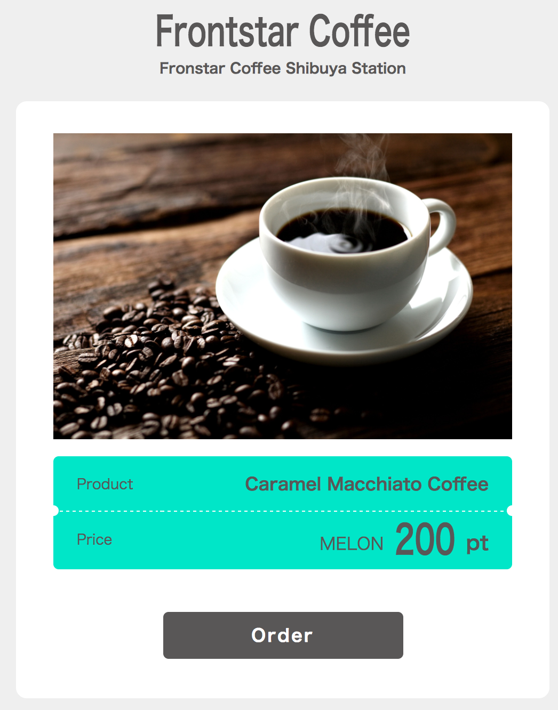
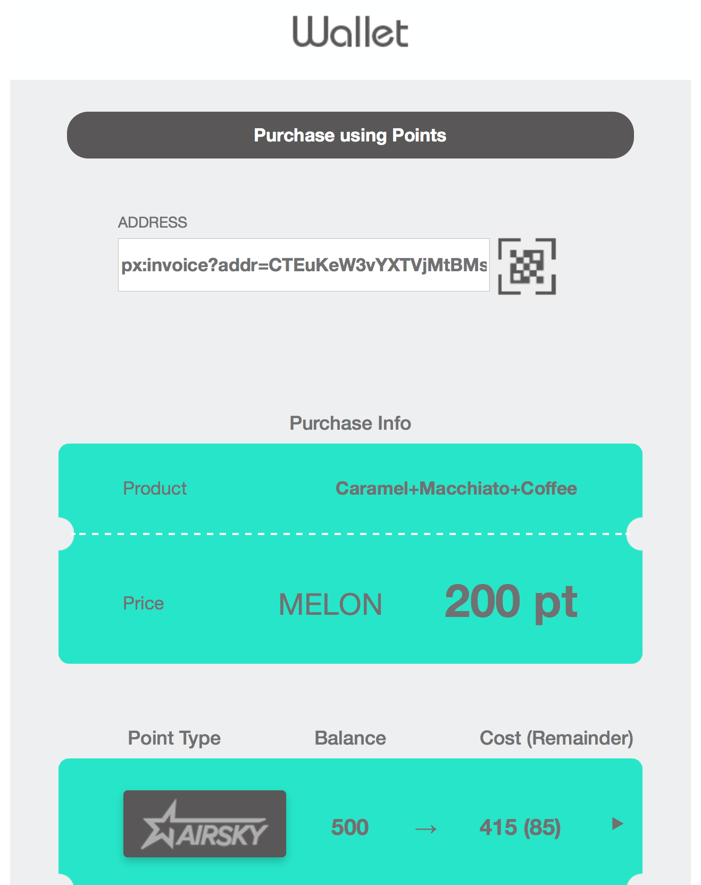
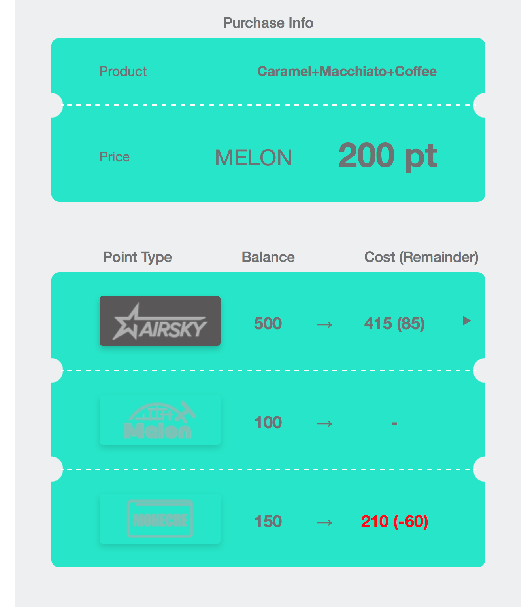
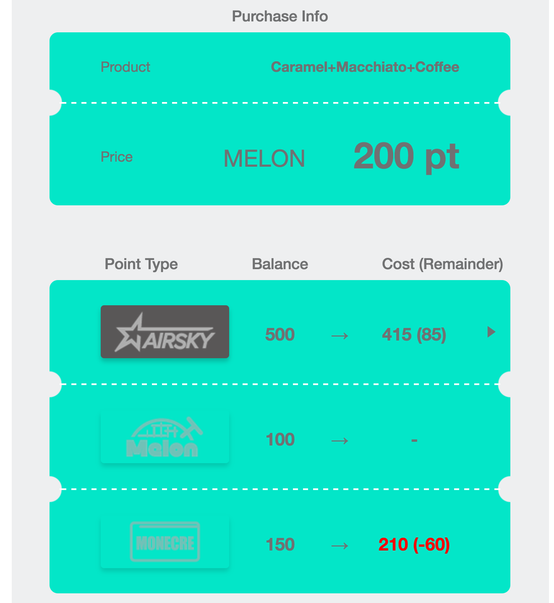
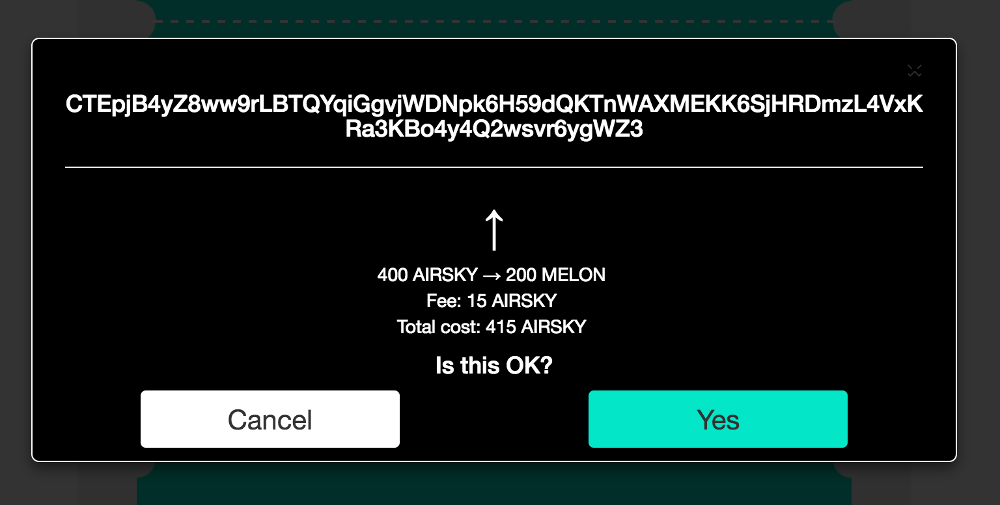
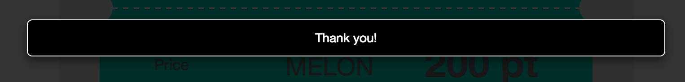

# Confidential Assets Demo

## Introduction

The Confidential Assets feature of Elements blockchain platform allows competing parties to interact
within the same blockchain without revealing crucial information to each other, such as the asset 
identities and quantities transferred in a given period.

This is a simple demonstration showing a scenario where a coffee shop (Dave the merchant) charges
a customer (Alice) for coffee using a given type of asset, which the customer does not presently hold.
To facilitate the purchase, the customer makes use of a point exchange system (Charlie) to convert one
of their other assets into the one Dave accepts.

Bob is a competitor trying to gather info about Dave's sales. Due to the CT/CA feature of Elements,
the idea is that he will not see anything useful at all by processing transactions on the blockchain.

Fred is completely uninteresting but necessary as he makes blocks on the blockchain when transactions
enter his mempool.

## Prerequisites

The demo uses the following libraries/tools:

* [Elements blockchain platform](https://github.com/ElementsProject/elements)
* [Go](https://golang.org/)
* [jq](https://stedolan.github.io/jq/)

Installation (Go and jq):
* (linux) using apt as `golang-1.7` and `jq`
* (macOS) using brew as `golang` and `jq`

## Installation and set up

The demo is written in Go with some HTML/JS components for UI related stuff.

The demo must be built. This can be done using the `build.sh` script.

There are five nodes, one for each party mentioned above, as well as several assets that must be
generated and given to the appropriate party before the demo will function. This can be automated using
the `start_demo.sh` script. For this to work, you must have `elementsd`, `elements-tx`, and `elements-cli`
in the path. E.g. by doing `export PATH=$PATH:/home/me/workspace/elements/src` or alternatively by doing
`make install` from `elements/src` beforehand.

`start_demo.sh` essentially does the following:

1. Sets up 5 Elements blockchain platform nodes and connects them to each other.
2. Generates the appropriate assets.
3. Sends assets to the appropriate parties.
4. Starts up the appropriate demo-specific daemons.

After this, open two pages in a web browser:
- http://127.0.0.1:8000/ (the customer Alice's UI)
- http://127.0.0.1:8030/order.html (the merchant Dave's order page)
- http://127.0.0.1:8030/list.html (the merchant Dave's admin page)

The idea is that Dave presents Alice with his UI, and Alice uses her UI (some app) to perform the
exchange.

## Screenshots














## License and Disclaimer

```
The MIT License (MIT)

Copyright (c) 2017 DG Lab

Permission is hereby granted, free of charge, to any person obtaining a copy
of this software and associated documentation files (the "Software"), to deal
in the Software without restriction, including without limitation the rights
to use, copy, modify, merge, publish, distribute, sublicense, and/or sell
copies of the Software, and to permit persons to whom the Software is
furnished to do so, subject to the following conditions:

The above copyright notice and this permission notice shall be included in
all copies or substantial portions of the Software.

THE SOFTWARE IS PROVIDED "AS IS", WITHOUT WARRANTY OF ANY KIND, EXPRESS OR
IMPLIED, INCLUDING BUT NOT LIMITED TO THE WARRANTIES OF MERCHANTABILITY,
FITNESS FOR A PARTICULAR PURPOSE AND NONINFRINGEMENT. IN NO EVENT SHALL THE
AUTHORS OR COPYRIGHT HOLDERS BE LIABLE FOR ANY CLAIM, DAMAGES OR OTHER
LIABILITY, WHETHER IN AN ACTION OF CONTRACT, TORT OR OTHERWISE, ARISING FROM,
OUT OF OR IN CONNECTION WITH THE SOFTWARE OR THE USE OR OTHER DEALINGS IN
THE SOFTWARE.
```
